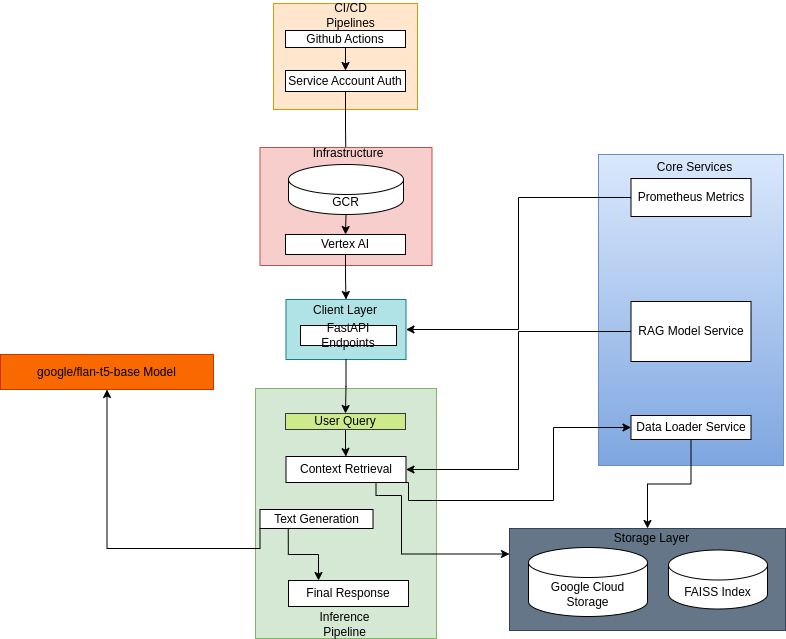
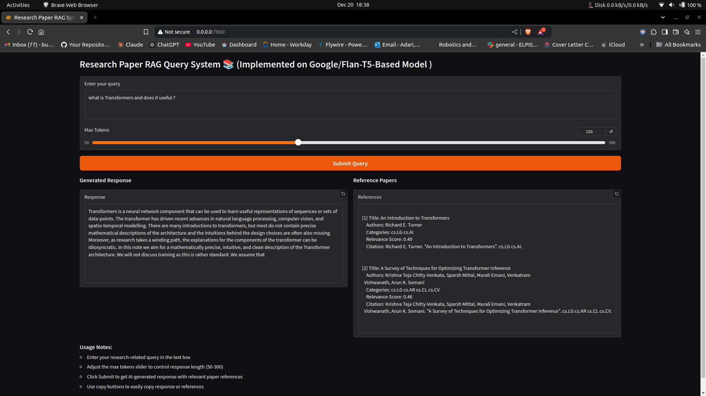
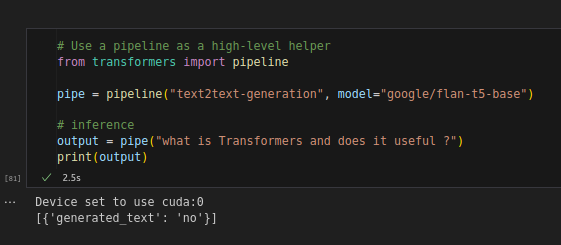

# Research Paper RAG System

A production-grade Retrieval-Augmented Generation (RAG) system deployed on Google Cloud Platform for research paper analysis and query answering.

## System Architecture

The system consists of several key components:



### 1. RAG Pipeline
- **Data Loader**: Processes arXiv dataset and manages data storage in GCS
- **Vector Store**: FAISS index for efficient similarity search
- **Embeddings**: Uses SentenceTransformer for document and query embeddings
- **Context Retriever**: Fetches relevant research papers based on queries

### 2. Model Pipeline
- **Base Model**: Flan-T5 for text generation
- **Tokenizer**: Handles text tokenization and preprocessing
- **Generation Service**: Manages response generation with configurable parameters

### 3. API Layer
- **FastAPI Backend**: RESTful API endpoints for model interaction
- **Gradio Interface**: User-friendly web interface for querying
- **Response Formatter**: Structures and formats model outputs

### 4. Infrastructure
- **Vertex AI**: Hosts the model endpoint
- **Google Cloud Storage**: Stores document embeddings and indexes
- **Container Registry**: Manages Docker images
- **IAM & Security**: Handles authentication and authorization

### 5. CI/CD Pipeline
- **GitHub Actions**: Automated deployment workflow
- **Docker**: Containerization for consistent deployments
- **Cloud Deploy**: Manages deployment to Vertex AI

## Setup Instructions

### Prerequisites
```bash
# Python 3.10+
python3 -m venv venv
source venv/bin/activate

# Install dependencies
pip install -r requirements.txt
```

### Environment Variables
```bash
export PROJECT_ID="research-paper-rag"
export REGION="us-central1"
export BUCKET_NAME="research-paper-rag-data"
export GOOGLE_APP_CREDENTIALS=<service-account-credentials>
```

### Requirements
```
fastapi==0.104.1
uvicorn==0.24.0
google-cloud-aiplatform==1.36.4
google-cloud-storage==2.13.0
sentence-transformers==2.2.2
faiss-cpu==1.7.4
transformers==4.35.2
torch==2.1.1
gradio==4.4.1
python-dotenv==1.0.0
```

## Project Structure
```
research-paper-rag/
├── src/
│   ├── data/
│   │   └── loader.py          # Data loading and processing
│   ├── models/
│   │   └── rag_model.py       # RAG model implementation
│   └── api/
│       └── main.py            # FastAPI endpoints
├── notebooks/
│   └── exploration.ipynb      # Development notebooks
├── tests/
│   └── test_model.py          # Unit tests
├── Dockerfile                 # Container configuration
├── requirements.txt           # Python dependencies
├── main.py                    # Application entry point
└── README.md                 # Documentation
```

## Deployment

### Local Development
```bash
# Run FastAPI server
uvicorn main:app --reload --host 0.0.0.0 --port 8080

# Run Gradio interface
python gradio_app.py
```

### Cloud Deployment
```bash
# Build and push Docker image
docker build -t gcr.io/$PROJECT_ID/research-paper-rag:latest .
docker push gcr.io/$PROJECT_ID/research-paper-rag:latest

# Deploy to Vertex AI
gcloud ai endpoints deploy-model $ENDPOINT_ID \
    --region=$REGION \
    --model=$MODEL_ID
```

## Usage

### Using Gradio Interface
1. Access the Gradio interface at `http://localhost:7860`
2. Enter your research query
3. Adjust max tokens (50-300)
4. Click Submit to get response and references



## Model Details

### RAG Implementation
- **Embedding Model**: all-MiniLM-L6-v2
- **Base Model**: Flan-T5-base
- **Vector Store**: FAISS with L2 similarity
- **Context Window**: 2048 tokens
- **Response Generation**: Beam search with temperature control

### Performance Metrics
- Average Response Time: ~2-3 seconds
- Memory Usage: ~2GB RAM
- GPU Utilization: ~70% (when available)

## Monitoring and Maintenance

### Health Checks
- Endpoint status monitoring
- Model performance metrics
- Error rate tracking

### Logs
```bash
# View logs
gcloud logging read "resource.type=aiplatform.googleapis.com/Endpoint"
```

### Inference On Base Model - google/flan-t5-base


## Model Used

In this project, I used the `google/flan-t5-base` model for text generation and RAG model implementation.

### About `google/flan-t5-base`

`google/flan-t5-base` is a pre-trained model from Google's FLAN (Fine-Tuned Language Net) series. It is a transformer-based model designed for natural language processing tasks like text generation, classification, and summarization.

You can find more information about this model and its original implementation on the [Hugging Face Model Hub](https://huggingface.co/google/flan-t5-base).

## Citation

This project uses the Flan-T5 model. If you use this in your research, please cite:

```bibtex
@misc{flan2022,
    author = {Shayne Longpre and Le Hou and Tu Vu and Albert Webson and Hyung Won Chung 
              and Yi Tay and Denny Zhou and Quoc V. Le and Barret Zoph and Jason Wei 
              and Adam Roberts},
    title  = {The Flan Collection: Designing Data and Methods for Effective Instruction Tuning},
    year   = {2022},
    url    = {https://arxiv.org/abs/2301.13688}
}
```